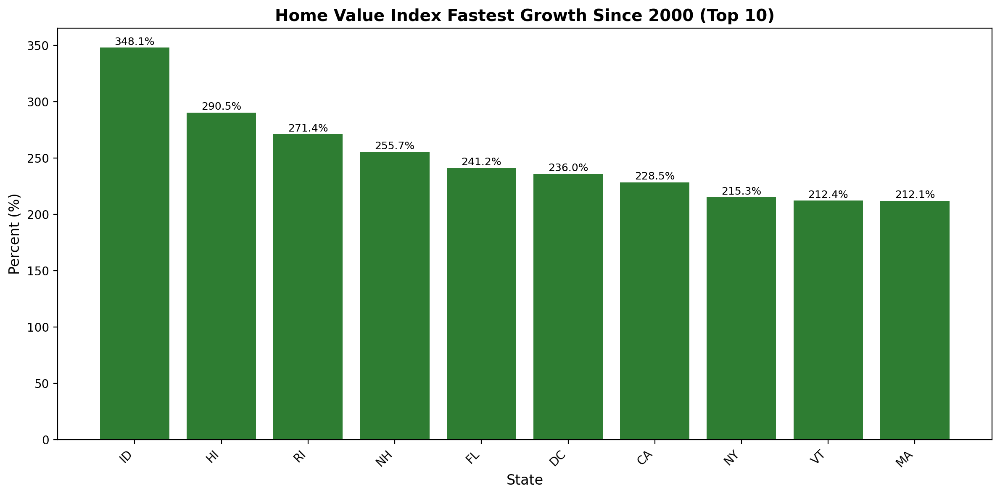
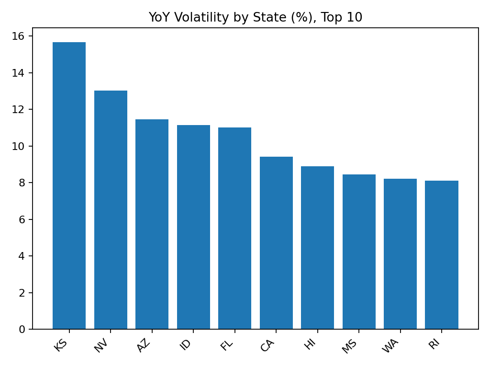

# Housing Value Analysis (2000–2025)

## 📑 Overview
This project analyzes **US state-level housing values** between 2000 and 2025.  
It highlights long-term growth, the impact of the 2008 financial crisis, volatility, and affordability gaps.

---

## 🛠 Methods
- Cleaned dataset (~43 MB, ~680,000 rows)  
- SQL queries using **DuckDB** (`sql/analysis.sql`)  
- Automated analysis with **Python** (`scripts/run_analysis.py`)  
- Reports generated as CSVs and charts (`reports/`)

---

## 🔍 Key Questions
- Which states experienced the **fastest housing value growth** since 2000?  
- Which states were **hardest hit during the 2008 housing crisis**?  
- Which states show the **highest volatility** in housing values?  
- Has the **gap widened** between the most and least expensive states?  

---

## 📊 Findings
- **Fastest growth since 2000:** [Replace with result from reports/fastest_growth_since_2000.csv]  
- **Hardest hit 2007–2009:** [Replace with result from reports/hardest_hit_2007_2009.csv]  
- **Most volatile states:** [Replace with result from reports/volatility_by_state.csv]  
- **Gap between expensive vs. affordable states:** [Replace with result from reports/gap_2000_vs_2025.csv]  

---

## 📈 Visuals
  
  

---

## 📑 Dataset
- **Full dataset:** `home_values_yearly_clean.csv` (~43 MB, ~680,000 rows) — tracked with *Git LFS*.  
- **Sample dataset:** `sample_home_values_yearly_clean.csv` (~60 KB) — included for quick inspection on GitHub.  

All analysis was run on the **full dataset**; the sample is for convenience.  

---
# Housing Value Analysis (2000–2025)

## 📑 Overview
This project analyzes **US state-level housing values** between 2000 and 2025.  
It highlights long-term growth, the impact of the 2008 financial crisis, volatility, and affordability gaps.

---

## 🛠 Methods
- **Dataset:** ~43 MB, ~680,000 rows (2000–2025)  
- **Tools:** SQL with DuckDB, Python (pandas, matplotlib)  
- **Process:**  
  1. Cleaned dataset (handled missing values, reshaped monthly → yearly averages).  
  2. Aggregated by **state and year**.  
  3. SQL queries stored in [`sql/analysis.sql`](sql/analysis.sql).  
  4. Automated pipeline with [`scripts/run_analysis.py`](scripts/run_analysis.py).  
  5. Generated reports (`reports/*.csv`) and charts (`reports/figures/*.png`).  

---

## 🔍 Key Questions
- Which states experienced the **fastest housing value growth** since 2000?  
- Which states were **hardest hit during the 2008 housing crisis**?  
- Which states show the **highest volatility** in housing values?  
- Has the **gap widened** between the most and least expensive states?  

---

## 📊 Findings
- **Fastest growth since 2000:**  
  States in the West and South showed the strongest appreciation. *[See full ranking in `reports/fastest_growth_since_2000.csv`]*
  
- **Hardest hit 2007–2009:**  
  Several states saw steep declines during the housing crisis, with double-digit percentage drops. *[See details in `reports/hardest_hit_2007_2009.csv`]*
  
- **Most volatile states:**  
  Markets in Nevada, Florida, and California showed the greatest fluctuations year-over-year. *[See `reports/volatility_by_state.csv`]*
  
- **Gap trend (2000 vs 2025):**  
  The difference between the most and least expensive states widened significantly, suggesting growing affordability disparities. *[See `reports/gap_2000_vs_2025.csv`]*

---

## 📈 Visuals
- **Fastest Growth Top 10**  
  

- **Hardest Hit 2007–2009 (Worst 10)**  
  

- **Volatility Top 10**  
  

---

## 📑 Dataset
- **Full dataset:** `data/home_values_yearly_clean.csv` (~43 MB, ~680,000 rows) — tracked with *Git LFS*.  
- **Sample dataset:** `data/sample_home_values_yearly_clean.csv` (~60 KB) — quick inspection on GitHub.  

👉 Analyses were run on the **full dataset**; the sample is included for convenience.  

---

## ⚖️ Limitations
- Analysis is at the **state level**; county/city trends may differ.  
- Yearly averages may mask short-term volatility within months.  
- Missing values in raw data were retained, which may affect some states.  

---

## 🚀 Future Work
- Add **rolling averages** to smooth out volatility.  
- Extend analysis to **affordability metrics** (housing vs. income).  
- Build an **interactive dashboard** (Tableau/Power BI/Streamlit).  
- Compare housing trends with **economic indicators** (GDP, employment).  

---
